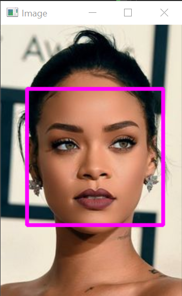
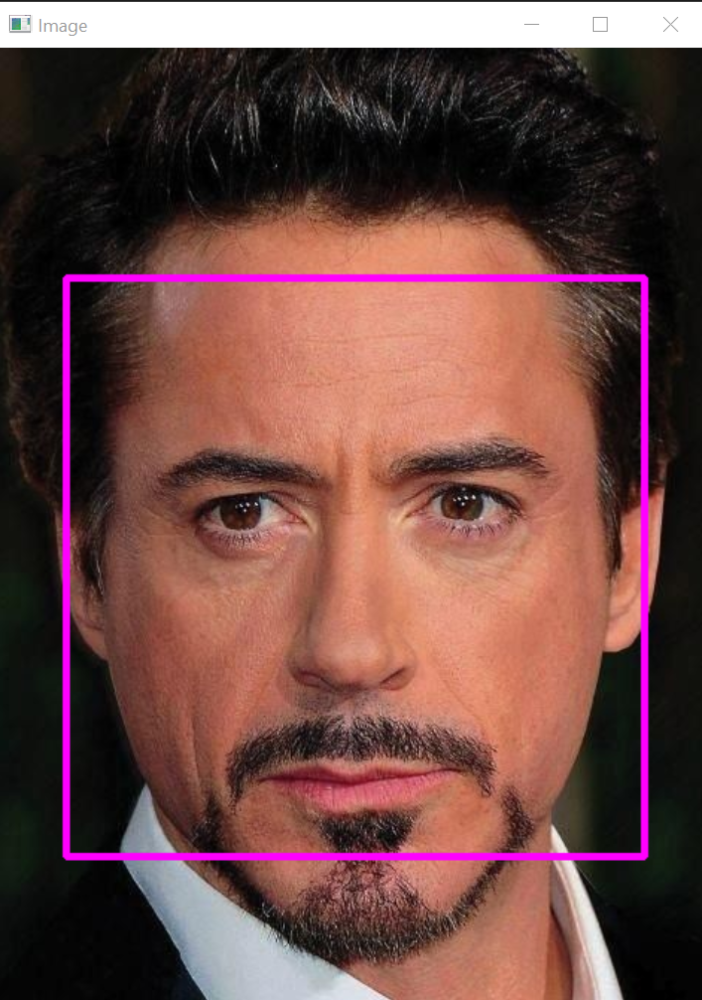
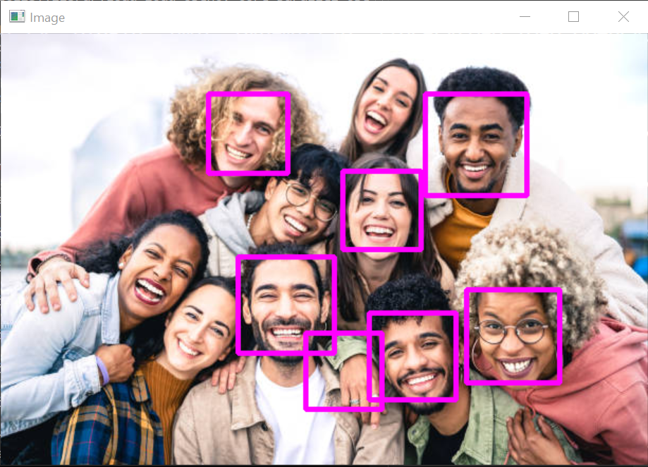
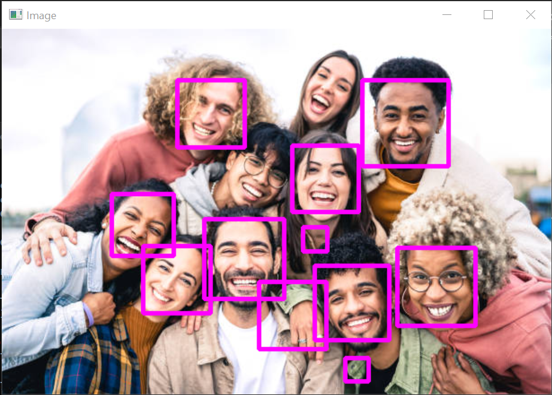

# Face Detection on Images

## Overview
This project implements a face detection system using OpenCV's pre-trained Haar Cascade classifier. The goal is to detect faces in images and highlight them with rectangles.

## Requirements
- OpenCV
- C++ Compiler
- Haar Cascade XML file (included in the Resources folder)

## Installation
1. Clone the repository:
   ```bash
   git clone https://github.com/YagmurTaze/Basic-Face-Detection-on-Image.git

## Results

Here are some sample results of the face detection project:





Scale: 1.1


Scale: 1.01


